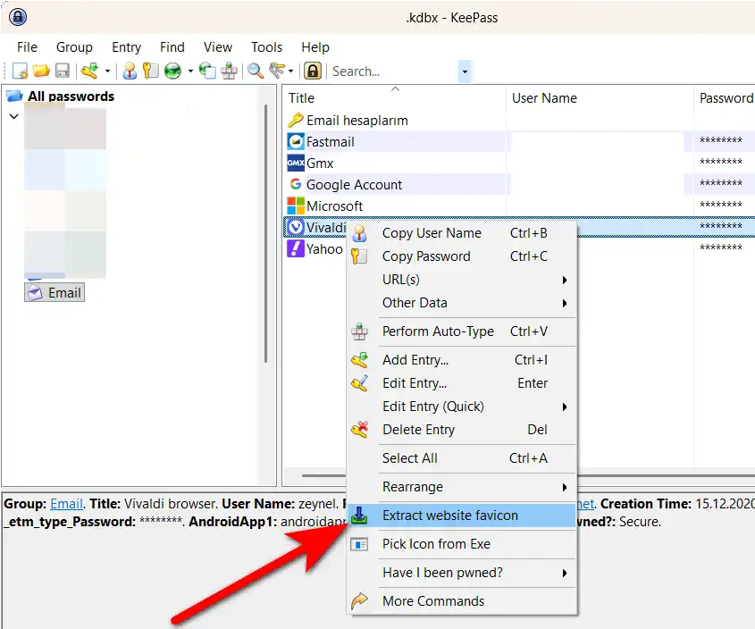
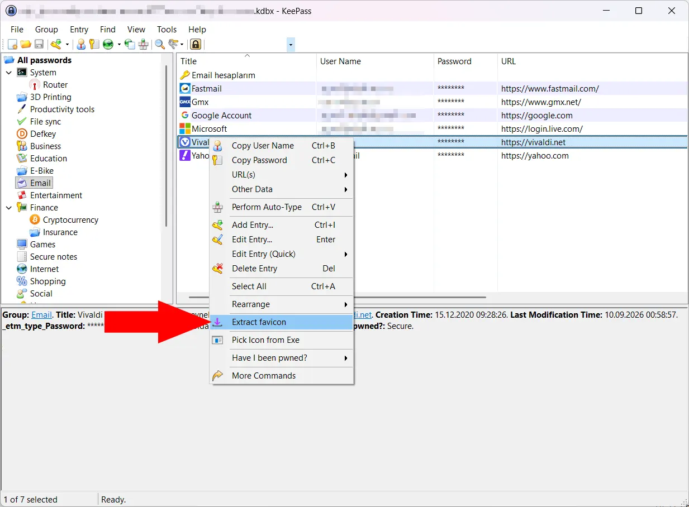

# KeePass Favicon Extractor

A KeePass 2 plugin that finds and downloads website favicons. The extension
uses multiple discovery methods, therefore it has a higher likelihood of finding a favicon.

## Highlights

- Entry right-click and main-menu integration in KeePass.
- Multi-source favicon discovery with ranked candidate selection: HTML parsing for fetching
favicon (SVG, PNG, WEBP, ICO supported); fallback to multiple external services including
Google, DuckDuckGo.
- 128x128 is the default size. Smaller icons aren't upscaled, but larger icons are downscaled to 128x128.
- Live extraction status and diagnostics windows.
- Guard against storing duplicate icons in the KeePass database.
- Diagnostics window allows you to check if extension is working properly.

## Installation

- Download latest version of the plugin from [Releases](https://github.com/zeynelozturk/KeepassFaviconExtractor/releases)
- Extract the .zip file into your KeePass `Plugins` directory. 
The plugin is contained within a directory named `FaviconExtractor`, so it will be a subdirectory of your `Plugins` directory.
- Restart KeePass.

## Usage

- Right click an entry in KeePass and select "Extract Favicon" from the context menu.
- The plugin will attempt to find and download a favicon for the entry's URL,
convert it to a suitable format. If a favicon is found, it will be assigned to the entry.

Note that this extension will change the icon of entry without confirmation.

We do not modify or delete previously stored icons.

## Network and privacy behavior

- The plugin makes outbound HTTP/HTTPS requests to the target site's URL to discover icons.
- If direct discovery fails, it may query external providers (for example Google, DuckDuckGo, Favicone, Vemetric, Favicon.im, and Hunter logo endpoint).
- External providers receive host/domain-based values (host and sometimes parent domain), not the full entry URL path/query.
- Redirects that end on private or loopback addresses can be blocked with `EnforcePrivateAddressBlocking` (default is compatibility-first).
- Native WEBP loading prefers plugin-local `native/x64` and `native/x86`; legacy broad path fallback is controlled by `AllowLegacyNativeLibrarySearchFallback`.
- Some response reads use explicit size caps (`MaxHtmlReadBytes`, `MaxPlaceholderHashReadBytes`) to reduce memory-risk from oversized responses.

## Licensing and Third-Party Notices

- This project is licensed under GPL-3.0. See [LICENSE](LICENSE).
- Third-party component notices and license texts are provided in [THIRD-PARTY-NOTICES.txt](THIRD-PARTY-NOTICES.txt).
- Release ZIP artifacts include both files.

## Contact

For questions, bug reports, or feature requests, please open an issue on GitHub,
or contact the author at `zeynel@defkey.com`.

If extension fails to download a favicon for a specific URL, please include the
text you see in the icon download window.

For build and development notes, see [DEVELOPMENT.md](DEVELOPMENT.md).
